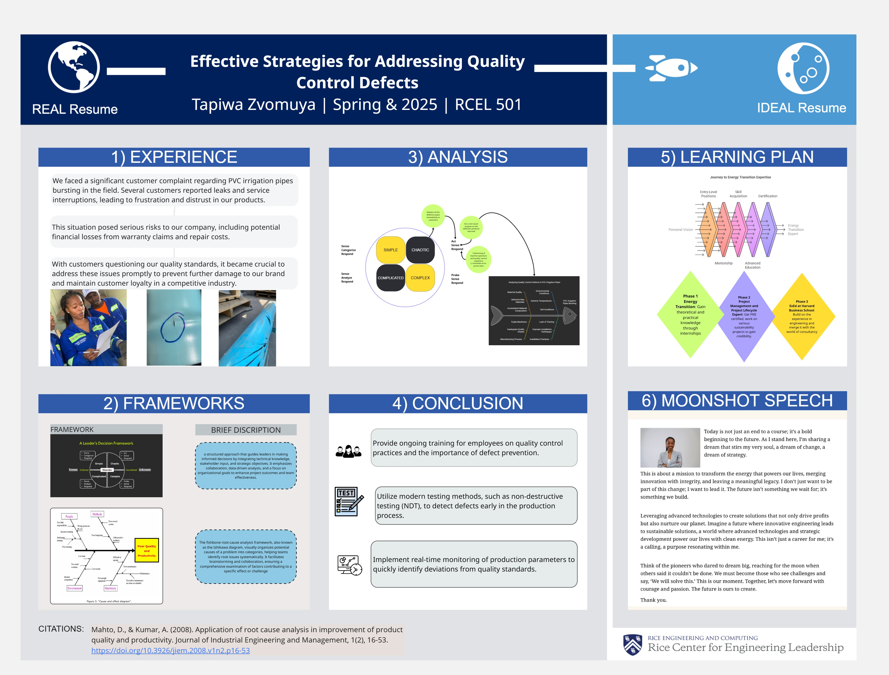

# RCEL 501 Poster-Presentation
## Applying Engineering Management Frameworks to industrial problems : Manufacturing Defects Troubleshooting

## Final Poster Presentation

# Author: Tapiwa Zvomuya
# Field: Engineering Quality Control
# Professor: Steve Gomez
